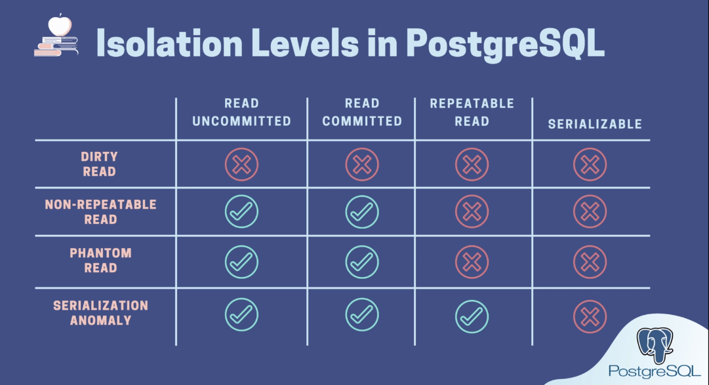
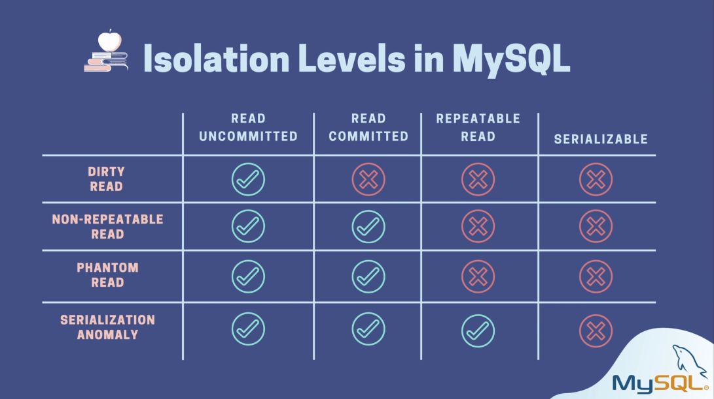

# Simplebank

A demo application build using Golang and Postgres.

This applciation is built during [this course](https://www.udemy.com/course/backend-master-class-golang-postgresql-kubernetes/)

## Things I Learnt

- [SQLC](https://github.com/kyleconroy/sqlc) - A Golang package that generates typesafe code from SQL files.
  - Generated code is fast as it uses the standard libray only.
  - Checks SQL errors while generating the code
  - Generates json tags and a lot more

- **Composition in Golang** - Composition in golang is a way to "inherit" behaviour from other structs without actually having to implement subclasses and superclasses.
  - They act like member variables with some syntactic sugar on top.
  - You still can initializes the "composite members" like you would any member in the strcut, just with typename as field name

    ```golang
      // Here, `Store` struct gets behaviour from `Queries` struct 
      type Store struct {
        *Queries
        db *sql.DB
      }

      // `Queries` struct is initialized normally by using type name as the field name
      func NewStore(db *sql.DB) *Store {
        return &Store{
          db:      db,
          Queries: New(db),
        }
      }
    ```

- **Database Transactions and Dealocks** - Although I know about basics of database transactions, there is a lot I learnt about them and how they interact with problems like deadlocks.
  - A transaction has an **isolation level** defined (either globally or for a particular db session) which governs what it can see and what it can't see
  - [These are implemented using different ways in different DB Engines to achieve similar results.](#isolation-levels-and-their-behaviour-in-different-db-engines)

  - Deadlocks can occur when 2 transaction try to update / read the same data (depending on the isolation level) at the same time.
    - To handle this, I had to implement the `addMoney` method in [store.go](./db/sqlc/store.go) which is called with the smaller ID first. (see `TransferTx`)
    - **The best way to deal with deadlocks is to avoid them**

### Isolation Levels and Their behaviour in different DB Engines



